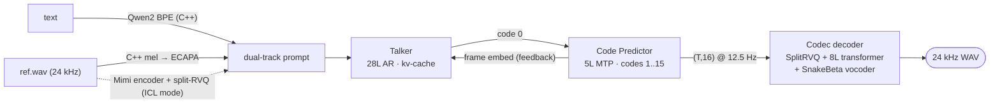

<div align="center">

# Qwen3-TTS-ncnn

**[Qwen3-TTS](https://github.com/QwenLM/Qwen3-TTS) (12 Hz · 0.6B) on [ncnn](https://github.com/Tencent/ncnn) — a pure-C++ text→speech pipeline with voice cloning, token-for-token faithful to PyTorch**

[](https://github.com/mingshi2333/Qwen3-TTS-ncnn/actions/workflows/ci.yml)
[](LICENSE)


Entry for Tencent/ncnn [#6791](https://github.com/Tencent/ncnn/issues/6791) (Rhino-Bird 2026)

</div>

---

## Highlights

- **Everything in C++/ncnn** — BPE tokenizer, mel/FFT front-end, speaker encoder, Mimi reference encoder + split-RVQ, both LLMs with SDPA kv-cache, and the vocoder. No dependency beyond ncnn itself.
- **Bit-faithful decoding** — free-running greedy generation reproduces the PyTorch fp32 reference **token-for-token**: 704/704 (x-vector clone), 8176/8176 (ICL clone, 511 frames), 656/656 (CustomVoice).
- **Fast** — RTF ≈ 3.4 on a laptop CPU vs ≈ 118 for PyTorch fp32 CPU (~35×). Vulkan tier runs on unmodified upstream ncnn.
- **Three voice modes** — x-vector cloning, in-context-learning cloning, and built-in CustomVoice speakers.
- **Linux + Windows** — MSVC CI plus a mingw-w64 cross-compile toolchain file; Windows binaries validated end-to-end under Wine.

## Pipeline



## Status

| Component | State |
|---|---|
| Talker (28L) / Code Predictor (5L) → ncnn + kv-cache | ✅ rel. err ≤ 5e-6, cached step ≤ 1.4e-6 |
| Codec decoder (full graph, dynamic length) | ✅ SNR 78/61 dB (two lengths) |
| BPE tokenizer (hand-written GPT-2 pre-tokenizer) | ✅ 139/139 vs `Qwen2Tokenizer` |
| Sampler (seeded top-k/top-p, HF processor order) | ✅ 24/24 distribution parity; seed → bit-identical |
| **Greedy E2E, x-vector clone** | ✅ **704/704 tokens == PyTorch** |
| **Greedy E2E, ICL clone (511 frames)** | ✅ **8176/8176 tokens == PyTorch** |
| **Greedy E2E, CustomVoice built-in speakers** | ✅ **656/656 tokens == PyTorch** |
| Speaker encoder (ECAPA) + C++ mel front-end | ✅ cos-sim 1.0000000 |
| Mimi encoder + C++ split-RVQ (ICL reference codes) | ✅ 0/1616 vs CPU-torch |
| Vulkan GPU backend (unmodified upstream ncnn) | ✅ 0/704, RTF 3.9 |
| Windows | ✅ MSVC CI green; mingw+Wine E2E 0/704, 0/656 |
| 1.7B / VoiceDesign | ⏳ optional follow-up |

## Performance

Ryzen 7745HX / RTX 4060 Laptop, fp32, 3.5 s utterance:

| Tier | RTF | Codec alone | Token parity |
|---|---|---|---|
| PyTorch fp32 CPU | ~118 | — | baseline |
| ncnn CPU fp32 (16T) | **~3.4** | ~1× RT | 704/704 |
| ncnn Vulkan fp32 | 3.9 | 3.4× RT | 704/704 |

The AR loop is latency-bound (tiny per-step GEMMs), so the GPU pays off on the codec, not the LLM.

## Build

```bash
cmake -B build -DCMAKE_BUILD_TYPE=Release
cmake --build build -j
ctest --test-dir build        # tokenizer + sampler always; e2e gates when models/ present
```

Requires C++17. ncnn ≥ `244f30c8` (SDPA kv-cache + RotaryEmbed layers) is fetched and
built automatically; pass `-Dncnn_DIR=<prefix>/lib(64)/cmake/ncnn` to use a local build instead.

<details>
<summary><b>Windows</b> — MSVC or cross-compile from Linux</summary>

MSVC: same two commands as above (see [`ci.yml`](.github/workflows/ci.yml)).
Cross-compile with mingw-w64, statically linked so the `.exe` runs under Wine:

```bash
cmake -B build-mingw -DCMAKE_TOOLCHAIN_FILE=cmake/mingw-w64-x86_64.toolchain.cmake -DCMAKE_BUILD_TYPE=Release
cmake --build build-mingw -j
wine build-mingw/e2e_codes.exe models tests/data 2055
```
</details>

## Convert the models

Converted nets are regenerated from the official checkpoint (only `tokenizer.txt` and
`model.json` are committed):

```bash
python -m venv venv && ./venv/bin/pip install -r tools/convert/requirements.txt
./venv/bin/pip install torch --index-url https://download.pytorch.org/whl/cu126   # GPU build recommended
hf download Qwen/Qwen3-TTS-12Hz-0.6B-Base --local-dir models/Qwen3-TTS-12Hz-0.6B-Base
git clone --depth 1 https://github.com/QwenLM/Qwen3-TTS tools/convert/Qwen3-TTS   # modeling source

cd tools/convert
python export_decoder.py talker && python export_decoder.py predictor
python export_codec.py && python export_small_nets.py
python export_speaker.py && python export_mimi.py && python export_tokenizer.py
python ref_e2e_greedy.py && python test_e2e_greedy.py        # oracle + python-side E2E gate
```

## Run

```bash
./build/tts_cli models ref.wav "你好，世界。" out.wav chinese [seed]    # x-vector voice clone
./build/tts_cli models-cv serena "你好，世界。" out.wav chinese [seed]  # built-in CustomVoice speaker
Q3TTS_VULKAN=1 ./build/tts_cli ...                                      # Vulkan tier
```

## Parity methodology

Free-running greedy decoding **is** matched token-for-token — with one precise caveat:
argmax near-ties flip across numeric domains (CPU vs GPU kernels), so the oracle must be
generated in the same domain as the deployment target. Within one domain we measure:

| Check | Result |
|---|---|
| CPU-torch golden vs C++ CPU (44 frames) | 704/704 |
| python-ncnn vs C++ (same domain, mixed zh/en text) | 960/960 |
| ICL clone, 511 frames free-running | 8176/8176 |
| CustomVoice, 41 frames | 656/656 |
| C++ CPU vs C++ Vulkan | 704/704 |
| Windows binary under Wine vs same goldens | 704/704, 656/656 |
| Cross-domain (GPU-torch golden vs CPU exec) | usually equal; can diverge (text-dependent) |

Teacher-forcing or per-stage cosine similarity alone would hide integration bugs
(prompt assembly, processor order, MTP head/table indexing) — the free-running gate caught
several during development. Seventeen conversion pitfalls are catalogued in the write-up.

## Acknowledgements

- [Qwen3-TTS](https://github.com/QwenLM/Qwen3-TTS) — the model (Apache-2.0)
- [ncnn](https://github.com/Tencent/ncnn) / pnnx — inference framework, `docs/developer-guide/kvcache.md`
- [futz12/ncnn_llm](https://github.com/futz12/ncnn_llm) — LLM-on-ncnn reference and the kv-cache patch approach

## License

Apache-2.0 (see [LICENSE](LICENSE)), matching the upstream model.
